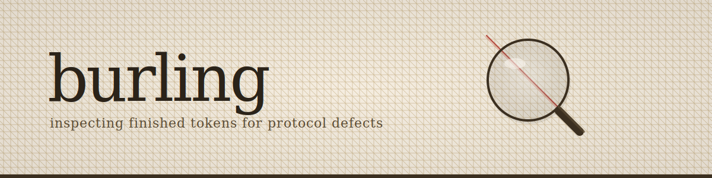
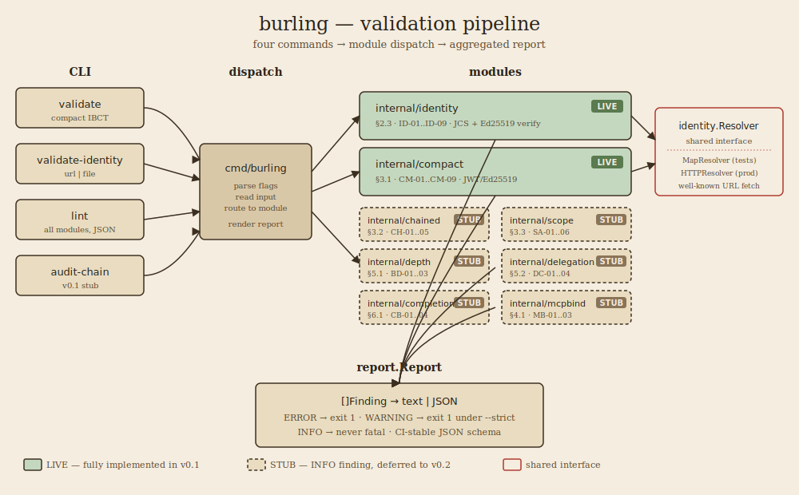

<p align="center"></p>

<h1 align="center">burling</h1>
<p align="center"><strong>AIP conformance validator and IBCT chain auditor.</strong></p>
<p align="center">
  burling validates Invocation-Bound Capability Tokens and identity documents against <br>
  every mechanically-checkable normative requirement in <code>draft-prakash-aip-00</code>.
</p>
<p align="center">
  <a href="#status">Status</a> ·
  <a href="#worked-example">Worked Example</a> ·
  <a href="#architecture">Architecture</a> ·
  <a href="#install">Install</a> ·
  <a href="docs/CONFORMANCE.md">Conformance</a> ·
  <a href="docs/EXPLAINER.md">Explainer</a> ·
  <a href="docs/spec-ambiguities.md">Ambiguities</a>
</p>

---

## What problem this solves

When an AI agent delegates a task to another agent, something has to prove what the second agent is allowed to do on behalf of the first — and what it isn't. Without that proof, a compromised downstream agent can quietly exceed its authority, and there's no audit trail connecting the original user's intent to what the final agent actually did. The Agent Identity Protocol (`draft-prakash-aip-00`) proposes a token format that answers this: a signed, scope-bounded, chain-verifiable credential for every agent-to-agent call.

burling is the conformance validator for those tokens. It catches broken delegation before it ships — unconstrained scope, invalid signatures, expired identities, tampered chains — by mechanically checking every normative requirement in the AIP draft. If your system produces or consumes AIP tokens and you want to know they're correct before they hit production, this is the tool that tells you.

> **New to agent identity?** The [plain-language explainer](docs/EXPLAINER.md) walks through the problem, the protocol, and the cleverest idea in ~600 words and three diagrams.

## Who this is for

- **Protocol implementers** building AIP issuers, verifiers, or runtimes — use burling as a conformance harness, both to test your own code and to check interop against other implementations.
- **MCP and agent-infrastructure developers** who need delegation tokens in CI — run `burling lint` in a pipeline step and fail the build if the token your code produces doesn't conform.
- **Security engineers** reviewing agent systems — use burling's findings plus the [spec-ambiguities doc](docs/spec-ambiguities.md) to evaluate whether a given AIP implementation matches the draft or quietly diverges from it.
- **People new to the protocol** — read the [explainer](docs/EXPLAINER.md), run the CLI against the committed fixtures, see what a real conformance run looks like.

<h2 id="status">Status</h2>

**v0.1 — internal milestone.** 18 of 43 conformance checks are fully implemented; the remaining 25 are stubbed and return an INFO finding noting deferral to v0.2. This is the first end-to-end conformance run against synthetic fixtures — not a public release. See `docs/MILESTONE-v0.1.md` for scope, and `docs/CONFORMANCE.md` for per-check status.

| Module | Spec | Checks | Status |
|--------|------|-------:|--------|
| Identity Document | §2.3 | 9 | **LIVE** |
| Compact Mode (JWT/Ed25519) | §3.1 | 9 | **LIVE** |
| Chained Mode (Biscuit) | §3.2 | 5 | stub (v0.2) |
| Scope Attenuation | §3.3 | 6 | stub (v0.2) |
| Bounded Delegation Depth | §3.4 | 3 | stub (v0.2) |
| Delegation Context | §3.5 | 4 | stub (v0.2) |
| Completion Blocks | §3.6 | 4 | stub (v0.2) |
| MCP Binding | §4.1 | 3 | stub (v0.2) |

<h2 id="architecture">Architecture</h2>

<p align="center"></p>

Four CLI commands feed a single dispatch layer in `cmd/burling`. Dispatch routes input to one of the validation modules under `internal/`. Each module emits `report.Finding` values which the CLI aggregates into a `report.Report` and renders as text or JSON. Identity and compact share the `Resolver` interface — `MapResolver` injected in tests, `HTTPResolver` in production for well-known URL lookups.

Packages, all under `github.com/goweft/burling/`:

- `internal/report` — finding type, severity enum, stable JSON schema
- `internal/identity` — §2.3 validator (ID-01..ID-09) plus a zero-dep JCS canonicalizer
- `internal/compact` — §3.1 JWT/Ed25519 validator (CM-01..CM-09); reuses `identity.Resolver`
- `internal/{chained,scope,depth,delegation,completion,mcpbind}` — v0.1 stubs, each emits one INFO finding
- `cmd/burling` — CLI front-end
- `testdata/gen` — fixture generator for the `testdata/example/` directory

<h2 id="install">Install</h2>

```
go install github.com/goweft/burling/cmd/burling@latest
```

Or from source:

```
git clone https://github.com/goweft/burling
cd burling
go build -o burling ./cmd/burling
```

Requires Go 1.22+. No third-party dependencies on the standard path; the Biscuit decision for chained mode is deferred to v0.2.

## CLI

```
burling validate          <token-file>   Validate a compact IBCT
burling validate-identity <url|file>     Validate an identity document
burling lint              <token-file>   All checks, JSON output for CI
burling audit-chain       <token-file>   Chained-mode audit (v0.1 stub)
```

Shared flags: `--format text|json`, `--strict` (promotes WARNING to failing exit code). ERROR findings always fail the exit code.

Exit codes:
- `0` — all checks passed (no ERROR, and no WARNING under `--strict`)
- `1` — at least one ERROR (or WARNING under `--strict`)
- `2` — CLI usage or I/O error

<h2 id="worked-example">Worked example</h2>

The repository includes committed fixtures under `testdata/example/` for experimenting with the CLI. They can be regenerated at any time with `go run ./testdata/gen -outdir testdata/example`.

**Validating a well-formed identity document:**

```
$ burling validate-identity testdata/example/identity.json
Target:  testdata/example/identity.json
Spec:    draft-prakash-aip-00
burling: dev

ERROR   [ID-08] §2.3  failed to resolve aip:web:example.com/issuer-alpha: identity document not found

Summary: 1 ERROR — FAIL
```

The identity document itself is structurally valid and its signature verifies. The single ERROR is ID-08: the document claims issuer `aip:web:example.com/issuer-alpha`, but there is no live HTTP endpoint at `https://example.com/.well-known/aip/issuer-alpha.json`. That's expected — the example.com domain has no AIP well-known location.

**Detecting a tampered signature:**

```
$ burling validate-identity testdata/example/identity-tampered.json
Target:  testdata/example/identity-tampered.json
Spec:    draft-prakash-aip-00
burling: dev

ERROR   [ID-06] §2.3  document_signature did not verify against any listed ed25519 public key
ERROR   [ID-08] §2.3  failed to resolve aip:web:example.com/issuer-alpha: identity document not found

Summary: 2 ERROR — FAIL
```

The tampered fixture has one byte flipped in the signature. burling catches it at ID-06 via the JCS canonicalization + Ed25519 verification path.

**Machine-readable output for CI:**

```
$ burling lint --format json testdata/example/token.jwt | jq '.findings[] | {check_id, severity, message}'
{
  "check_id": "CM-03",
  "severity": "ERROR",
  "message": "failed to resolve issuer \"aip:web:example.com/issuer-alpha\": ..."
}
{
  "check_id": "SA-00",
  "severity": "INFO",
  "message": "scope-attenuation validation deferred to v0.2 (depends on chained mode)"
}
...
```

## Design principles

- **Zero third-party dependencies** on the standard path. Biscuit for chained mode is the single deferred exception.
- **Table-driven tests** with programmatically generated crypto fixtures. No static signed-document fixtures committed (rationale in `testdata/identity/README.md`).
- **CI green from day one**: `go test ./... -race -cover`, `go vet`, and `golangci-lint`.
- **Small verified steps**: review gates between modules, matrix-ordered implementation.

## Documentation

- [`docs/EXPLAINER.md`](docs/EXPLAINER.md) — plain-language explainer for people new to agent identity
- [`docs/conformance-matrix.md`](docs/conformance-matrix.md) — the full 43-check test matrix, with severities and spec references
- [`docs/CONFORMANCE.md`](docs/CONFORMANCE.md) — per-check implementation status for the current version
- [`docs/spec-ambiguities.md`](docs/spec-ambiguities.md) — open questions flagged to the spec author
- [`docs/MILESTONE-v0.1.md`](docs/MILESTONE-v0.1.md) — v0.1 scope and done criteria

## Relationship to AIP

burling tracks `draft-prakash-aip-00`. The draft is expected to evolve; burling will update its matrix and add new ambiguity entries as the spec moves.

The project exists as a wedge into the AIP ecosystem: an independent conformance harness is concrete value to protocol implementers regardless of which runtimes adopt AIP, and its careful line-by-line reading of the draft surfaces ambiguities worth resolving upstream.

## The WEFT ecosystem

burling is the conformance layer. The rest of the stack:

| Project | Language | What it does |
|---|---|---|
| **[heddle](https://github.com/goweft/heddle)** | Python | The policy-and-trust layer for MCP tool servers. Downstream integration target for AIP. |
| **[cas](https://github.com/goweft/cas)** | Go | Conversational Agent Shell — terminal TUI where conversation generates workspaces. |
| **[ratine](https://github.com/goweft/ratine)** | Python | Agent memory poisoning detector. |
| **[crocking](https://github.com/goweft/crocking)** | Python | AI authorship detector for git repositories. |

## About the name

The name follows the [goweft](https://github.com/goweft) textile convention: *burling* is the process of inspecting finished cloth for defects and removing them. burling inspects finished IBCTs for protocol defects.

## Status of outreach

The spec author has been notified that this project exists and that the five initial ambiguities documented in `docs/spec-ambiguities.md` have been flagged for upstream discussion.

## License

Apache 2.0. Matches the rest of the [goweft](https://github.com/goweft) stack.
