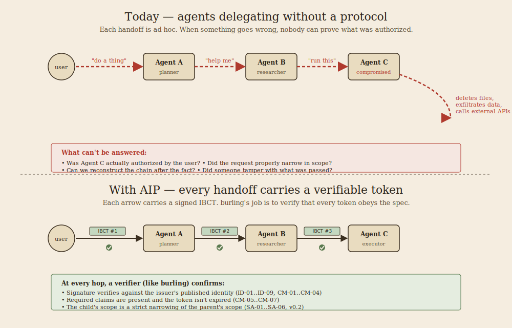
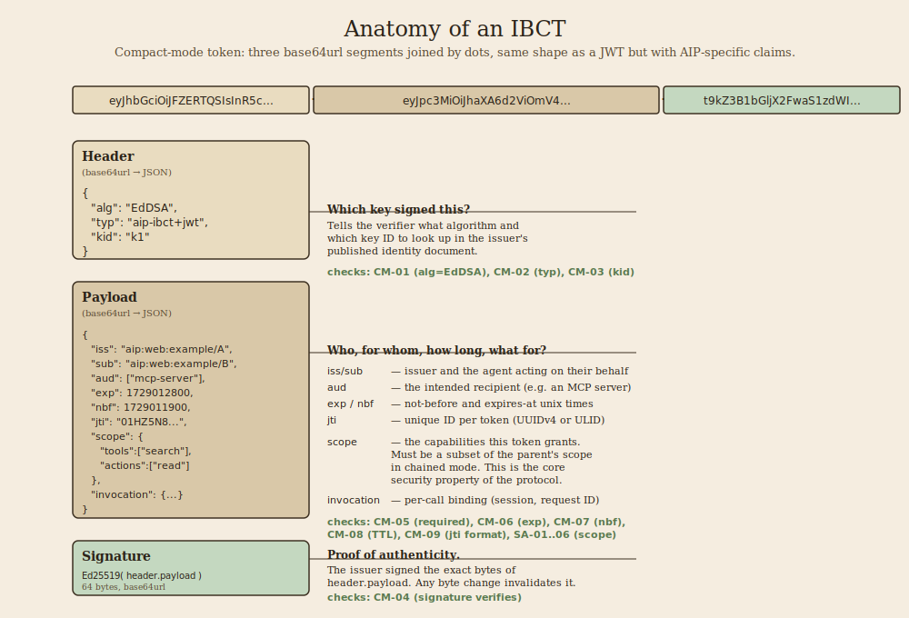
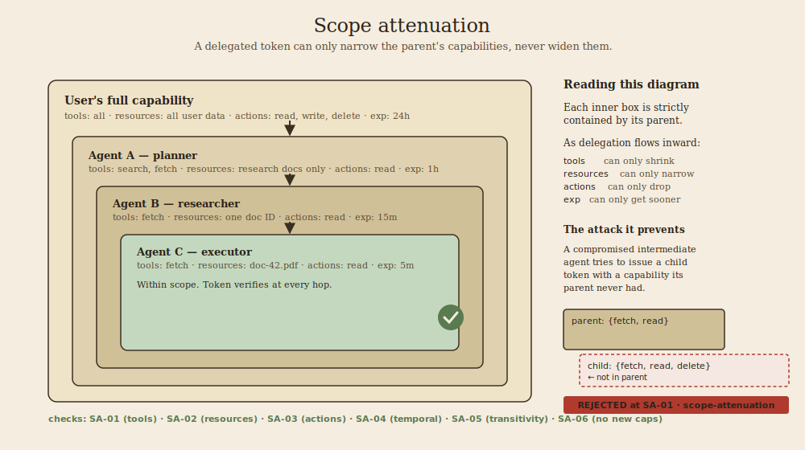

# Why burling exists

*A plain-language explainer for people new to agent identity.*

---

If you've built anything with LLM agents, you've probably felt this moment: one agent needs to ask another agent to do something. Maybe the "agents" are tools in an MCP server. Maybe they're functions in an agentic framework. Maybe they're whole separate processes. The shape is the same — work moves through a chain of automated actors, and at each handoff someone is acting *on behalf of* someone else.

Today, that handoff is almost always ad-hoc. The original user's authority gets passed along as raw credentials, or as a trust-me claim in a prompt, or as nothing at all. When it works, nobody notices. When it doesn't work, the failure modes are spectacular.

## The problem

The top half of that picture is where most agentic systems live today. A user asks Agent A to do something. Agent A needs help, so it talks to Agent B. Agent B calls out to Agent C. Each arrow carries some request, but none of them carries verifiable proof that the request was authorized by the original user, or that it's a proper subset of what the user actually asked for.

Now imagine Agent C is compromised — maybe it was tricked by a prompt-injection attack, maybe the model was swapped, maybe it was malicious from the start. What stops it from deleting files, calling external APIs, exfiltrating data? In many real systems today, nothing does. And afterward, nobody can tell whether what happened was a bug, a breach, or just how the system normally behaves, because there's no audit trail connecting the user's original intent to what the final agent actually did.

This is the territory OWASP's Agentic Top 10 is mapping. It's not theoretical — it's what keeps people who've shipped real agent systems awake at night.

## The protocol

The Agent Identity Protocol (AIP, currently [`draft-prakash-aip-00`](https://github.com/goweft/burling/blob/master/docs/conformance-matrix.md)) proposes a standard answer. The core idea is a signed token called an IBCT — an Invocation-Bound Capability Token — that every agent-to-agent call carries.

If you've seen a JWT, the shape is familiar. Three parts separated by dots: a header saying how it's signed, a payload saying who, for whom, for how long, and what capabilities are granted, and a signature proving none of it was tampered with. The AIP draft adds specific requirements on top of plain JWT — particular algorithms, a specific `typ`, a fixed set of required claims, and the security-critical `scope` field that says exactly what this token grants.

When Agent A delegates to Agent B, A issues a new IBCT to B. When B delegates to C, B issues one to C. The chain is signed end-to-end. Any verifier can check, at any hop, that every token was properly issued, hasn't expired, and hasn't been tampered with.

## The cleverest idea

The single most important property of the protocol is called **scope attenuation**. It's the idea that makes the whole thing safe.

Delegation can only narrow. A child token can grant only capabilities its parent already had — fewer tools, fewer resources, fewer actions, a sooner expiration. It can never widen. A compromised intermediate agent trying to grant capabilities it doesn't have produces a token that fails verification at the next hop.

This is structurally similar to the way OAuth scopes work, or the way capability-based security systems like Biscuit and Macaroons work. AIP takes the best of those ideas and adapts them for agent-to-agent delegation.

## Where burling fits

A specification is a document. A conformant implementation is code. The distance between them is where bugs hide.

burling's job is to stand between the spec and any implementation and ask: does this token *really* obey the 43 rules the spec lays out? Did the signature actually verify? Does the child scope actually narrow the parent? Is the expiration actually in the future?

Three ways people use it:

- **As a CI guard.** `burling lint my-token.jwt` in a pipeline step. If the token your code produces doesn't conform, the build fails before it ships.
- **As a debugging aid.** When a token is rejected somewhere and you don't know why, `burling validate` tells you exactly which check failed, with a citation to the spec section.
- **As an interop referee.** Two independent AIP implementations can test against each other using burling as the neutral third party. If both sides produce tokens burling accepts, they can interoperate.

burling isn't trying to be the AIP runtime — that's a downstream project's job. burling is trying to be the thing that makes "we implement AIP" a claim someone can check rather than just trust.

## What's next

v0.1 covers identity documents and compact-mode tokens — 18 of 43 checks in the matrix. The remaining 25 are stubbed for v0.2, mostly because they involve chained mode (which uses Biscuit tokens, a different underlying format with real implementation decisions still to be made).

If you're an AIP implementer, the conformance matrix and the spec-ambiguities doc are the most useful places to go next:

- [`docs/conformance-matrix.md`](conformance-matrix.md) — the full 43-check test matrix
- [`docs/CONFORMANCE.md`](CONFORMANCE.md) — per-check implementation status
- [`docs/spec-ambiguities.md`](spec-ambiguities.md) — open questions flagged for upstream discussion

If you want to see what a passing and failing run looks like, the [Worked Example](../README.md#worked-example) section of the README has real output against committed fixtures.
